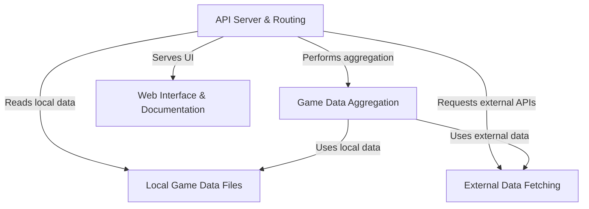
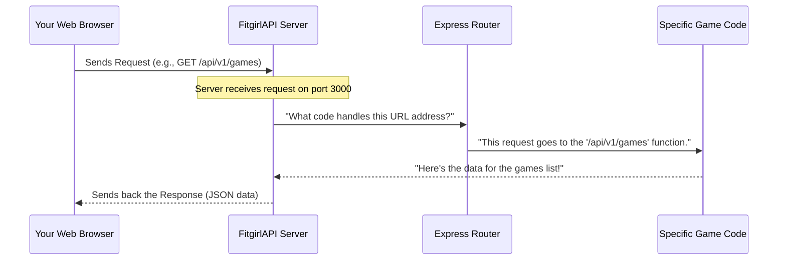
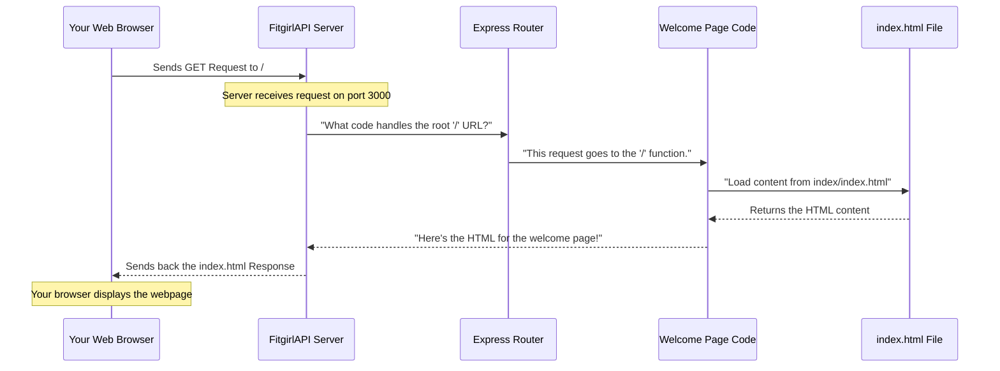
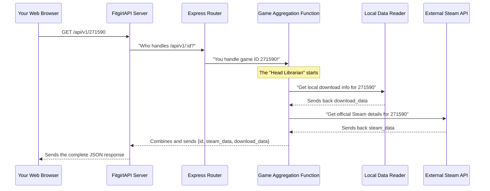
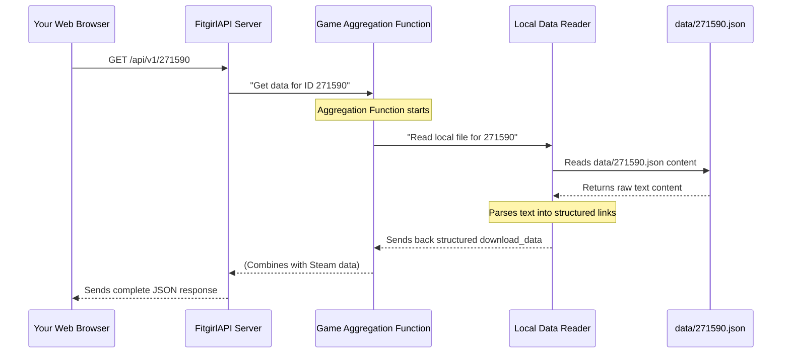
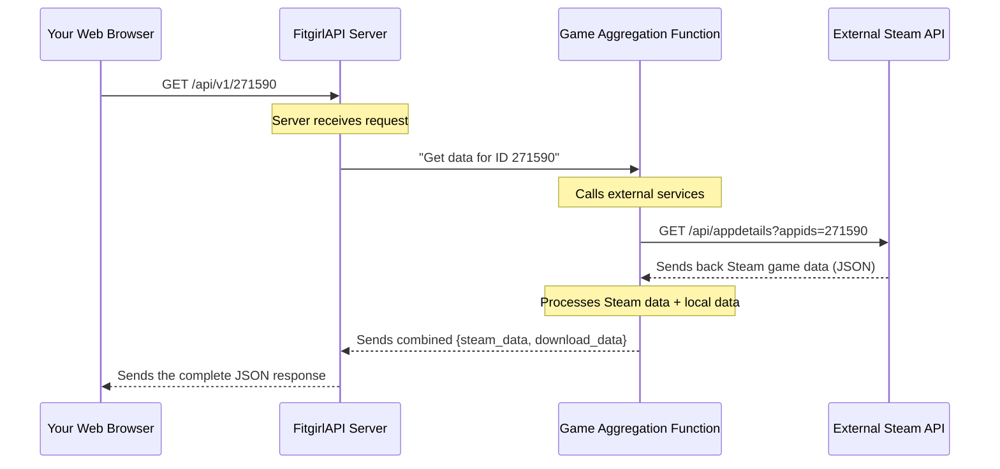

# FitgirlAPI

This project, `FitgirlAPI`, acts as a central **REST API** server that provides rich game data. It *aggregates information* by combining **local download links** from FitGirl Repacks with official game details fetched from **external services** like Steam and SteamSpy. Additionally, it offers a user-friendly **web interface** with clear documentation for developers.


## Visual Overview



## Chapters

1. [API Server & Routing
](01_api_server___routing_.md)
2. [Web Interface & Documentation
](02_web_interface___documentation_.md)
3. [Game Data Aggregation
](03_game_data_aggregation_.md)
4. [Local Game Data Files
](04_local_game_data_files_.md)
5. [External Data Fetching
](05_external_data_fetching_.md)

---


# Chapter 1: API Server & Routing

Welcome to the exciting world of APIs! In this first chapter, we're going to peek behind the curtain of the `FitgirlAPI` project and understand its "brain" – the API Server and its Routing system.

## The Central Control Room: Your Post Office for Data

Imagine you want to send a letter, but you don't know the exact address. Or, you send a letter, but the post office doesn't know where to deliver it! That's where a "server" and "routing" come in handy for our API.

Think of our `FitgirlAPI` as a specialized **post office**.
*   It's constantly open, waiting for people to send letters (requests).
*   When a letter arrives, it looks at the address (the URL path).
*   It then quickly figures out which specific clerk (a piece of code) should handle that letter.
*   The clerk processes the letter and sends back a reply (a response).

This "post office" job is handled by our **API Server**, and the process of figuring out which clerk gets which letter is called **Routing**.

So, what problem does this solve? It lets different programs (like your web browser, a mobile app, or another script) **ask for specific information** from our API, and the API knows exactly how to **respond with the right data**.

### Our First Mission: Getting a List of Games

Let's say you're building a website and you want to show a list of all the games available through the FitgirlAPI. How do you "ask" the API for this list? You'll send a request to a specific "address" or **endpoint**. Our server will then use its routing system to deliver your request to the right code that knows how to fetch all game names.

## The Main Job: Listening for Requests

Our API server's first and most important job is to constantly listen for incoming requests. It's like a receptionist waiting for the phone to ring.

In Node.js, we use a popular library called **Express** to create our server.

```javascript
// server.js (Simplified)
const express = require('express'); // 1. Bring in the Express library
const app = express();              // 2. Create our server application
const PORT = process.env.PORT || 3000; // 3. Decide which "door" (port) to listen on

// ... more code for routing and handling requests ...

app.listen(PORT, () => {            // 4. Start listening!
    console.log(`Server is running on http://localhost:${PORT}`);
});
```
**Explanation:**
1.  `require('express')` is like saying "I need the Express toolkit."
2.  `app = express()` creates an instance of our server application. Think of it as setting up the post office building.
3.  `PORT` is the "door number" our server will use. If you open your web browser and go to `http://localhost:3000`, you're trying to reach our server through door number 3000 on your own computer (`localhost`).
4.  `app.listen()` is the command that officially opens our post office for business, waiting for requests on that specified `PORT`. When it starts, it prints a message to your console.

## Meeting the Demands: Routing Requests

Once our server is listening, it needs to know what to do when a request comes in. This is where **routing** comes in. Routing is simply matching the "address" (URL path) of an incoming request to the correct piece of code that will handle it.

Each specific "address" on our API is called an **endpoint** or **route**. For example, `/api/v1/games` is an endpoint.

In Express, we define routes using methods like `app.get()`. `GET` is a type of request that simply asks for information.

Let's look at some important routes in our `FitgirlAPI`.

### 1. The Welcome Mat: `/` (Root Endpoint)

This is the simplest address, like walking up to the main entrance of the post office. It usually serves a welcome page or basic information.

```javascript
// server.js
app.get('/', (req, res) => {
    // When someone visits http://localhost:3000/, send them our main page.
    res.sendFile(path.join(__dirname, 'index', 'index.html'));
});
```
**Explanation:**
*   `app.get('/')` means: "When a `GET` request comes to the root path `/`, run this function."
*   `req` (request) is an object containing all the details about the incoming request.
*   `res` (response) is an object we use to send data back to the client.
*   `res.sendFile()` tells the browser to display a specific HTML file.

**Try it:** Open your browser and go to `http://localhost:3000/`. You'll see the API's welcome page!

### 2. Getting All Games: `/api/v1/games`

This is our main mission: getting a list of all game names!

```javascript
// server.js (Simplified for focus)
app.get('/api/v1/games', (req, res) => {
    // ... (Code to read game data from files, covered in Chapter 4) ...
    
    // For now, imagine we just have a list of game names:
    const gameNames = ["Elden_Ring", "Cyberpunk_2077", "Red_Dead_Redemption_2"];
    
    res.json({ games: gameNames }); // Send a JSON response with the game names
});
```
**Explanation:**
*   `app.get('/api/v1/games')` defines a route. When a `GET` request comes to `http://localhost:3000/api/v1/games`, the function inside will run.
*   `res.json()` is a super useful function that sends back data in a special format called **JSON (JavaScript Object Notation)**. It's a common way for APIs to send structured data.

**Try it:** Go to `http://localhost:3000/api/v1/games` in your browser. You'll see a list of games, like:
```json
{"games":["Elden_Ring", "Cyberpunk_2077", "Red_Dead_Redemption_2"]}
```

### 3. Getting a Specific Game: `/api/v1/:id`

What if you want details for just ONE specific game, like "Elden Ring"? Instead of making a separate route for every single game, we use a trick called **route parameters**.

```javascript
// server.js (Simplified for focus)
app.get('/api/v1/:id', async (req, res) => {
    const gameId = req.params.id; // Get the specific ID from the URL!
    
    // ... (Code to look up and combine game data, covered in Chapters 4 & 5) ...

    // For now, imagine we just confirm the ID:
    res.json({
        id: gameId,
        message: `You asked for details about game ID: ${gameId}`
    });
});
```
**Explanation:**
*   `app.get('/api/v1/:id')` is special. The `:id` part is a **wildcard**! It means "whatever text comes after `/api/v1/` in the URL, capture it and call it `id`."
*   We can then access this captured value using `req.params.id`.
*   This allows us to have *one* route definition handle requests for *thousands* of different games, simply by changing the ID in the URL.

**Try it:**
*   Go to `http://localhost:3000/api/v1/271590` (271590 is the Steam ID for Grand Theft Auto V).
*   You'll see a response containing detailed information about that specific game, combined from different sources (more on that in later chapters!).
*   If you tried `http://localhost:3000/api/v1/123`, you'd get information for game `123`.

## Behind the Scenes: How It All Works

Let's visualize the journey of your request from your browser to our API and back.



1.  **Your Web Browser** (or any client application) sends an HTTP request to our `FitgirlAPI` server.
2.  The `FitgirlAPI` **Server** (our `express` app) receives this request because it's actively `listen`ing on `PORT 3000`.
3.  The server then passes the request details to its internal **Router**. The router is like the map of our post office, showing which addresses (endpoints) lead to which desks (handler functions).
4.  The **Router** matches the request's URL path (e.g., `/api/v1/games`) with one of the `app.get()` definitions and directs it to the appropriate **Handler Function**.
5.  The **Handler Function** is the actual JavaScript code that does the work (like reading files, fetching data, etc., which we'll cover in [Game Data Aggregation](03_game_data_aggregation_.md) and [External Data Fetching](05_external_data_fetching_.md)). It then prepares the data.
6.  Finally, the **Handler Function** sends this prepared data back to the `FitgirlAPI` **Server**, which then sends it back as a **Response** to your **Web Browser**.

## Keeping Things Friendly: CORS

You might have noticed this line in `server.js`:
```javascript
// server.js
const cors = require('cors'); // Import the CORS library
// ...
app.use(cors()); // Use CORS middleware
```
**CORS (Cross-Origin Resource Sharing)** might sound fancy, but it's like a bouncer at a club. By default, web browsers are very protective. If a website from `my-awesome-frontend.com` tries to get data from our `FitgirlAPI` at `localhost:3000`, the browser might block it, thinking it's a security risk (since they are different "origins").

`app.use(cors())` tells our API server: "It's okay! Allow requests from *any* website. We trust them." This is crucial for our API to be used by various web applications without running into browser security errors.

## Summary of Core Routes

| Route (URL Path)        | Method | Description                                       | Example Input                  | Example Output (Simplified)    |
| :---------------------- | :----- | :------------------------------------------------ | :----------------------------- | :----------------------------- |
| `/`                     | `GET`  | Displays the API's welcome page.                  | `http://localhost:3000/`       | An HTML welcome page           |
| `/api/v1/games`         | `GET`  | Retrieves a list of all available game IDs.       | `http://localhost:3000/api/v1/games` | `{"games": ["game1", "game2"]}` |
| `/api/v1/popular`       | `GET`  | Fetches popular game IDs (filtered by local data).| `http://localhost:3000/api/v1/popular` | `{"popular": ["gameX", "gameY"]}` |
| `/api/v1/:id`           | `GET`  | Gets detailed information for a specific game ID. | `http://localhost:3000/api/v1/271590` | `{"id": "271590", "steam_data": {...}}` |

## Conclusion

In this chapter, we've set up the foundational understanding of our `FitgirlAPI`. We learned that the API Server acts as a central hub, constantly listening for requests. The Routing system then intelligently directs these requests to the correct "handler functions" based on their URL paths. We also touched upon CORS, an essential mechanism for allowing our API to communicate freely with different web applications.

This understanding of how requests are received and directed is fundamental to how any API works! Next, we'll explore how this API provides a friendly [Web Interface & Documentation](02_web_interface___documentation_.md) to make it easy for anyone to discover and use its features.

---


# Chapter 2: Web Interface & Documentation

Welcome back, aspiring API explorers! In [Chapter 1: API Server & Routing](01_api_server___routing_.md), we learned how our `FitgirlAPI` acts as a clever post office, listening for requests and sending them to the right "clerks" (handler functions). But imagine walking into that post office, and it's just a blank room with no signs or friendly faces. How would you know what services are offered or where to go?

That's exactly the problem our **Web Interface & Documentation** solves!

## The API's Welcome Mat and Instruction Manual

Think of this part of our project as the `FitgirlAPI`'s **friendly welcome mat** and its **clear instruction manual**, all rolled into one beautiful webpage. When you visit the API's main address (like `http://localhost:3000/` in your browser), you're not just getting raw data; you're greeted by a user-friendly page.

**What problem does this solve?**
It helps developers (and anyone curious!) quickly understand:
1.  **What the API does**: A quick overview of its purpose.
2.  **How to use it**: A clear list of all the "addresses" (endpoints) you can send requests to.
3.  **What to expect**: Explanations of what kind of information you'll get back from each endpoint.

It's designed to make starting with our API as easy as possible, without needing to dig through code or separate documents. It's like finding a treasure chest with a map and a "how-to" guide already attached!

### Our Mission: Discovering the API's Features

Let's say you're a new developer and you want to use the `FitgirlAPI`. Your main goal is to figure out *what* it can do. The easiest way to achieve this is by simply visiting the API's main URL in your web browser.

## What You See: A User-Friendly Guide

When you open your browser and navigate to `http://localhost:3000/` (or the deployed version like `https://fitgirlapi.onrender.com`), you'll see a visually appealing webpage. This isn't just a pretty face; it's an interactive guide!

Here’s a simplified view of what you might see:

```html
<!-- index/index.html (Excerpt) -->
<header class="hero">
    <h1>Game Data <span class="text-gradient">Aggregator</span></h1>
    <p>A robust, high-performance REST API that dynamically merging rich official Steam metadata with download links...</p>
    
    <div class="url-card">
        <div class="url-label">BASE URL</div>
        <code class="url-value" id="baseUrl">https://fitgirlapi.onrender.com</code>
        <button class="btn-copy">
            <i class='bx bx-copy'></i>
        </button>
    </div>
</header>

<main id="endpoints" class="container">
    <div class="section-header">
        <h2 class="section-title">Available Endpoints</h2>
        <p class="section-subtitle">Seamlessly integrate game data into your frontend application with these intuitive routes.</p>
    </div>

    <div class="grid">
        <!-- Example Endpoint Card -->
        <div class="card">
            <div class="endpoint-header">
                <span class="method-badge bg-get">GET</span>
                <code class="endpoint-path">/api/v1/games</code>
            </div>
            <h3 class="card-title">List All Games</h3>
            <p class="card-desc">Returns a comprehensive array of all available games...</p>
            <div class="params-box">
                <div class="params-title">Response Data</div>
                <div class="param-row">
                    <span class="param-name">games</span>
                    <span class="param-desc">Array of Game IDs stored in the directory</span>
                </div>
            </div>
        </div>
        <!-- ... more endpoint cards ... -->
    </div>
</main>
```
**Explanation:**
This HTML code (`index.html`) is structured to be very clear:
*   **Hero Section**: Gives a grand introduction to what the API is all about.
*   **Base URL Card**: Clearly shows the main address to send requests to. This is super helpful!
*   **Endpoints Section**: This is the "instruction manual" part. It lists each "address" (like `/api/v1/games`), what kind of request it expects (`GET`), what it does, and what kind of information you'll get back.

It's like a menu at a restaurant, showing you all the dishes (endpoints), what they're made of (parameters), and what they taste like (response data)!

## Behind the Scenes: Delivering the Web Interface

How does the API server deliver this helpful webpage when you visit the root URL (`/`)? Let's trace the journey:



1.  **Your Web Browser** sends a `GET` request to the API's base URL (e.g., `http://localhost:3000/`).
2.  The `FitgirlAPI` **Server** (our Express application) receives this request.
3.  The **Router** (from [API Server & Routing](01_api_server___routing_.md)) sees that the request is for the root path (`/`).
4.  It directs the request to the specific **Root Handler** function that we defined for the `/` route.
5.  This **Root Handler**'s job is to read and send back the `index.html` file.
6.  The `FitgirlAPI` **Server** then sends this HTML content back to your **Web Browser**.
7.  Finally, your **Web Browser** interprets the HTML, CSS, and JavaScript to display the interactive welcome page.

## The Code That Serves the Page

From [Chapter 1: API Server & Routing](01_api_server___routing_.md), you saw this line in `server.js`:

```javascript
// server.js
const path = require('path'); // Needed to work with file paths

// ... other setup code ...

// 1. Root endpoint: /
app.get('/', (req, res) => {
    res.sendFile(path.join(__dirname, 'index', 'index.html'));
});
```
**Explanation:**
*   `app.get('/')` is the routing part. It says, "When a `GET` request comes to the main URL (`/`), execute the function that follows."
*   Inside the function, `res.sendFile()` is the key. This command tells our server to take a specific file (our `index.html`) and send it directly to the browser that made the request.
*   `path.join(__dirname, 'index', 'index.html')` is a smart way to find the `index.html` file, no matter where our project is running on your computer. It builds the full path to the file.

This simple piece of code is responsible for greeting every visitor to our API with a helpful and informative webpage!

## Key Elements of the Web Interface

Here's a summary of the crucial information the `FitgirlAPI`'s web interface provides:

| Element           | Description                                                                    | Example Content (Simplified)                 |
| :---------------- | :----------------------------------------------------------------------------- | :------------------------------------------- |
| **API Title/Description** | High-level summary of the API's purpose.                                       | "Game Data Aggregator"                         |
| **Base URL**      | The main address developers will use to access the API.                        | `https://fitgirlapi.onrender.com`            |
| **Endpoint List** | A clear list of all available routes.                                          | `/api/v1/games`, `/api/v1/popular`, `/api/v1/:id` |
| **Endpoint Method** | Specifies the HTTP method for each endpoint (e.g., `GET`).                     | `GET`                                        |
| **Endpoint Description** | Explains what each endpoint does.                                              | "List All Games", "Get Popular Games"        |
| **Parameters**    | Details about any required or optional inputs for an endpoint (e.g., `:id`). | `:id` (The official Steam App ID)            |
| **Response Data** | What kind of information to expect back from the API.                          | `games` (Array of Game IDs)                  |
| **Copy URL Button** | An interactive button to easily copy the base URL for use in code.           | (An icon that copies the URL)                |

This comprehensive documentation on the landing page significantly lowers the barrier for new users to start working with the `FitgirlAPI`.

## Conclusion

In this chapter, we explored the `FitgirlAPI`'s "welcome mat" – its Web Interface & Documentation. We learned that by simply visiting the main URL, developers are greeted with a user-friendly page that clearly outlines the API's purpose, lists all available endpoints, and explains how to use them. This is made possible by a specific route (`app.get('/')`) in our server that sends the `index.html` file. This intuitive approach makes the API much more accessible and developer-friendly.

Next, we'll dive into how the API actually gets and organizes the game information it provides. Get ready to explore [Game Data Aggregation](03_game_data_aggregation_.md)!

---


# Chapter 3: Game Data Aggregation

Welcome back, API adventurers! In [Chapter 1: API Server & Routing](01_api_server___routing_.md), we learned how our `FitgirlAPI` acts like a smart post office, listening for your requests and directing them. Then, in [Chapter 2: Web Interface & Documentation](02_web_interface___documentation_.md), we saw how it provides a friendly "welcome mat" to guide you through its features.

Now, let's get to the real magic: how the API gathers all the different pieces of information about a game and presents it to you as one complete, easy-to-understand package. This process is called **Game Data Aggregation**.

## The Super Librarian: Combining Knowledge from Different Sources

Imagine you're trying to find out everything about a new video game.
*   You visit the official game store (like Steam) to get details about its story, screenshots, release date, and user reviews. This is like talking to a **Specialized Librarian for Official Game Details**.
*   Then, you might look for specific download options from a private, organized archive you trust. This is like talking to a **Specialized Librarian for Download Links**.

Now, imagine you have a **Head Librarian**. This Head Librarian doesn't just point you to the other two; they go to both, gather all the information, combine it neatly, and give you *one comprehensive answer*. You get the official details AND the download options, all in one go!

**What problem does this solve for our API?**
The `FitgirlAPI`'s main goal is to give you a complete picture of a game, including both its rich official details (like genre, developer, images) and its specific download links. But this information doesn't all come from one place! It's scattered across different sources. **Game Data Aggregation** is the process of bringing all these pieces together.

This means you, as a user of the API, don't have to make multiple requests or combine data yourself. The API does all the heavy lifting for you!

### Our Mission: Getting a Complete Game Picture

Our goal is to ask the API for details about *one specific game* and receive a response that includes everything: its official details from an external source (like Steam) AND its specific download links from our local files.

## The Two Sources of Truth

For our `FitgirlAPI`, the "two specialized librarians" are:

1.  **Local Game Data Files**: These are files stored directly within our `FitgirlAPI` project (in the `data/` folder). They usually contain unique download links and specific notes. Think of this as our private, curated archive. We'll dive much deeper into these in [Chapter 4: Local Game Data Files](04_local_game_data_files_.md).
2.  **External Data Fetching (Steam API)**: This is when our API reaches out to *another* API on the internet (like Steam's official API) to get official, public game information. This provides things like game descriptions, genres, images, and release dates. We'll explore this more in [Chapter 5: External Data Fetching](05_external_data_fetching_.md).

The **Game Data Aggregation** process is the "Head Librarian" that intelligently pulls information from both these sources and merges them.

## Using the API for Aggregated Data

To get the complete picture of a single game, you'll use the specific game endpoint we briefly saw in [Chapter 1: API Server & Routing](01_api_server___routing_.md): `/api/v1/:id`.

**Example Input:**
Let's try to get all information for a popular game like Grand Theft Auto V. Its Steam ID (a unique identifier) is `271590`.

You would send a `GET` request to:
`http://localhost:3000/api/v1/271590`

**Example Output (Simplified):**
When you visit this URL in your browser, the API will respond with a JSON object that looks something like this:

```json
{
  "id": "271590",
  "steam_data": {
    "type": "game",
    "name": "Grand Theft Auto V",
    "steam_appid": 271590,
    "header_image": "https://cdn.akamai.steamstatic.com/steam/apps/271590/header.jpg",
    "short_description": "When a young street hustler, a retired bank robber and a terrifying psychopath...",
    "genres": [ { "id": "71", "description": "Action" }, ... ],
    // ... many more official details from Steam ...
  },
  "download_data": {
    "parsed_links": [
      { "category": "Mirror 1", "url": "http://example.com/gta5/mirror1.part1.rar" },
      { "category": "Mirror 1", "url": "http://example.com/gta5/mirror1.part2.rar" },
      // ... specific download links from our local files ...
    ]
  }
}
```
Notice how the response has two main sections: `steam_data` (all the official details) and `download_data` (all the specific download links). This is the aggregated data!

## How the Head Librarian Works: Behind the Scenes

When you request `/api/v1/:id` for a specific game, here's what happens inside our `FitgirlAPI`'s post office:



1.  **Your Web Browser** sends a `GET` request for a specific game ID (e.g., `271590`).
2.  The `FitgirlAPI` **Server** receives this request.
3.  The **Router** (from Chapter 1) matches `/api/v1/271590` to the `/api/v1/:id` route and directs it to the **Game Aggregation Function**.
4.  The **Game Aggregation Function** (our "Head Librarian") starts its work:
    *   First, it asks the **Local Data Reader** to fetch download information from our internal `data/` folder.
    *   Next, it reaches out to the **External Steam API** to get official game details.
    *   *Important*: These two steps often happen at the same time to save time!
5.  Once both sets of information are collected, the **Game Aggregation Function** combines them into a single, structured JSON object.
6.  Finally, this combined JSON response is sent back through the **API Server** to your **Web Browser**.

## The Code That Aggregates Data

Let's look at the `server.js` file, specifically the `app.get('/api/v1/:id')` route, to see how this aggregation is coded.

```javascript
// server.js (Simplified for focus)
// ... (imports and setup code) ...

app.get('/api/v1/:id', async (req, res) => { // 'async' means this function can wait for things
    const gameId = req.params.id; // 1. Get the game ID from the URL

    // 2. Try to read local download data (more in Chapter 4)
    let localDownloadData = null;
    // Imagine some code here to read files from the 'data/' folder
    // For now, let's pretend it always finds something:
    localDownloadData = { parsed_links: [{ category: "Mirror", url: "http://example.com/link" }] };

    // 3. Try to fetch external Steam data (more in Chapter 5)
    let steamData = null;
    try {
        const steamResponse = await fetch(`https://store.steampowered.com/api/appdetails?appids=${gameId}`);
        const steamJson = await steamResponse.json();
        if (steamJson[gameId] && steamJson[gameId].success) {
            steamData = steamJson[gameId].data;
        }
    } catch (e) {
        console.error('Error fetching Steam data:', e.message);
        steamData = { error: 'Failed to fetch Steam data' };
    }

    // 4. Combine and send the response!
    res.json({
        id: gameId,
        steam_data: steamData,
        download_data: localDownloadData
    });
});

// ... (app.listen code) ...
```
**Explanation:**

1.  `const gameId = req.params.id;`: This line extracts the game ID (like `271590`) from the URL. Remember, `:id` is a wildcard that `Express` captures for us.
2.  `localDownloadData = { ... };`: This part represents where we would read data from our local files. We'll explore the actual code for this in [Chapter 4: Local Game Data Files](04_local_game_data_files_.md). For now, just know it's getting game-specific download links.
3.  `const steamResponse = await fetch(...)`: This is where our API talks to the external Steam API. `await` means "wait here until the Steam API sends back its information." We then process this response to get the official game details. We'll learn more about `fetch` in [Chapter 5: External Data Fetching](05_external_data_fetching_.md).
4.  `res.json({ id: gameId, steam_data: steamData, download_data: localDownloadData });`: This is the final aggregation step! It takes all the collected `steam_data` and `localDownloadData`, bundles them together with the `gameId` into one neat JSON object, and sends it back to your browser.

This single route `app.get('/api/v1/:id')` is the heart of our data aggregation, providing a unified view of each game.

## Components of Aggregation

| Component                | Role                                                                | Source                                  |
| :----------------------- | :------------------------------------------------------------------ | :-------------------------------------- |
| **Request ID (`:id`)**   | The unique identifier for the game you want information about.      | URL parameter (`req.params.id`)         |
| **Local Game Data**      | Provides specific download links, mirrors, and local notes.         | Files in the `data/` directory (internal) |
| **External Steam Data**  | Offers official game details like title, description, genres, images.| Steam API (external)                      |
| **Aggregation Logic**    | Combines the local and external data into a single, structured response. | `app.get('/api/v1/:id')` handler function |
| **JSON Response**        | The final, combined data sent back to the user.                     | Output of the handler function            |

## Conclusion

In this chapter, we uncovered the crucial concept of **Game Data Aggregation**. We learned how the `FitgirlAPI` acts as a "Head Librarian," bringing together information from two distinct "specialized librarians" – our local data files and the external Steam API. This allows the API to provide a complete, rich, and unified view of each game with a single request to the `/api/v1/:id` endpoint.

Now that we understand *why* and *how* data is aggregated, let's dig into the details of one of our data sources: the local game data files. Get ready to explore [Chapter 4: Local Game Data Files](04_local_game_data_files_.md)!

---


# Chapter 4: Local Game Data Files

Welcome back, intrepid API explorers! In [Chapter 3: Game Data Aggregation](03_game_data_aggregation_.md), we learned how our `FitgirlAPI` acts like a super librarian, bringing together official game details from external sources (like Steam) and specific download links from its *own* internal knowledge. Now, it's time to shine a spotlight on that internal knowledge: the **Local Game Data Files**.

## The API's Private Recipe Book: Your Download Links

Imagine you have a special cookbook filled with unique recipes that only you know. Each recipe is on its own card, and on that card, you've written down all the ingredients and steps. For our `FitgirlAPI`, these **Local Game Data Files** are exactly like those individual recipe cards.

**What problem does this solve?**
The `FitgirlAPI` needs a reliable place to store all the *specific* download links, mirrors, and notes related to FitGirl game releases. These are details that aren't found on official platforms like Steam. By keeping them in dedicated local files, the API can quickly retrieve this crucial information when someone asks for a particular game. It's where all the FitGirl-specific download information resides, neatly organized and ready to be served.

This means when you request a game's details, the API knows exactly where to look for its unique download instructions!

### Our Mission: Finding Download Links for a Specific Game

When you ask the API for information about a game (like Grand Theft Auto V, with Steam ID `271590`), one of the most important pieces of information you want is the list of download links. These links are stored right here, in our local data files.

## What Are These "Recipe Cards"?

The `FitgirlAPI` stores game-specific download information in a special folder named `data/` within the project. Each game gets its own file inside this folder.

*   **File Name**: Each file is named after the game's unique **Steam ID**. For example, the file for Grand Theft Auto V (Steam ID `271590`) would be named `271590.json`. Even though the extension is `.json`, these files typically contain plain text structured like a bulleted list of links.
*   **Content**: Inside each file, you'll find an organized list of download links. These links often include comments or descriptions after a `#` symbol, which helps the API understand what each link is for (e.g., "part1.rar", "fg-optional-videos.bin").

Let's look at an example from the `data/` folder:

```
--- File: data/271590.json ---
##Proper setup.exe - use it instead the one included in RARs
- https://fuckingfast.co/vfbwzk70mrqi#setup_proper.exe

##Download links
- https://fuckingfast.co/f4ebnujsyl45#GTAV_Legacy_--_fitgirl-repacks.site_--_.part001.rar
- https://fuckingfast.co/w95bq8nw3y2r#GTAV_Legacy_--_fitgirl-repacks.site_--_.part002.rar
- ... (many more links) ...
- https://fuckingfast.co/wqfpkyu3e9ha#fg-optional-bonus-content.part6.rar
```
**Explanation:**
This is a snippet from the `271590.json` file.
*   You can see the `##Proper setup.exe` and `##Download links` headers, which categorize the links.
*   Below these, each line starting with `- ` is a download link.
*   The `#` symbol separates the actual URL from a descriptive label (like `setup_proper.exe` or `GTAV_Legacy_--_fitgirl-repacks.site_--_.part001.rar`). This is very important for the API to correctly "read" and understand these "recipe cards".

## How the API Reads These "Recipe Cards"

When you request a game (like `271590`), the `FitgirlAPI` follows these steps to get the local download data:



1.  **Your Web Browser** sends a request to the API for a specific game ID.
2.  The **API Server** receives this request and, as we learned in [Chapter 3: Game Data Aggregation](03_game_data_aggregation_.md), passes it to the **Game Aggregation Function**.
3.  The **Game Aggregation Function** needs the local download links, so it asks the **Local Data Reader** to get them for the specified game ID.
4.  The **Local Data Reader** finds the correct file (e.g., `data/271590.json`) and reads its entire content as plain text.
5.  After reading the text, the **Local Data Reader** doesn't just send the raw text back. Instead, it carefully goes through each line, extracts the URL and its description, and organizes them into a structured format (like an array of objects, where each object has a `url` and `category`).
6.  This structured `download_data` is then sent back to the **Game Aggregation Function**, which combines it with other data (like Steam details) before sending the full response to your browser.

## The Code That Reads and Parses

Let's look at how the `FitgirlAPI` handles reading and understanding these local files.

First, the API needs to locate the correct file and read its content:

```javascript
// utils/dataUtils.js (Simplified)
const fs = require('fs'); // Needed to work with files
const path = require('path'); // Needed to build file paths

// Points to the 'data/' folder relative to this script
const dataFolderPath = path.join(__dirname, '..', 'data'); 

function readLocalGameFile(gameId) {
    const filePath = path.join(dataFolderPath, `${gameId}.json`); // e.g., 'data/271590.json'

    if (fs.existsSync(filePath)) { // Check if the file actually exists
        return fs.readFileSync(filePath, 'utf8'); // Read the file as text
    }
    return null; // Return nothing if the file isn't found
}
```
**Explanation:**
*   `fs` is a Node.js module for interacting with the file system (reading/writing files).
*   `path` helps us create correct file paths that work on different operating systems.
*   `dataFolderPath` creates the full path to our `data/` directory.
*   `readLocalGameFile(gameId)` takes a `gameId` (like `271590`), builds the expected `filePath`, checks if the file exists, and if so, reads its content as plain text using `fs.readFileSync()`.

Next, this raw text needs to be transformed into something structured that the API can use:

```javascript
// utils/dataUtils.js (Simplified - part of the same file)

function parseDownloadLinks(fileContent) {
    const parsedLinks = [];
    if (!fileContent) return parsedLinks;

    const lines = fileContent.split('\n'); // Split the entire text into individual lines

    let currentCategory = 'Unknown'; // Default category for links

    for (const line of lines) {
        const trimmedLine = line.trim();

        if (trimmedLine.startsWith('##')) { // If it's a category header (like "##Download links")
            currentCategory = trimmedLine.substring(2).trim(); // Extract category name
        } else if (trimmedLine.startsWith('- https://') || trimmedLine.startsWith('- http://')) { // If it's a download link
            // Remove the starting '- '
            const linkPart = trimmedLine.substring(2).trim(); 
            const hashIndex = linkPart.indexOf('#');

            let url = linkPart;
            let name = currentCategory; // Use the last seen category as a default name

            if (hashIndex !== -1) { // If there's a '#' separating URL and description
                url = linkPart.substring(0, hashIndex);
                // Extract the name part after '#' and clean it up
                name = linkPart.substring(hashIndex + 1)
                               .replace(/--_fitgirl-repacks.site_--_/g, '') // Remove a common pattern
                               .trim(); 
            }
            
            parsedLinks.push({ category: currentCategory, url, name }); // Add to our list
        }
    }
    return parsedLinks;
}
```
**Explanation:**
*   `parseDownloadLinks(fileContent)` takes the raw text we read earlier.
*   It splits the text into separate `lines`.
*   It then loops through each `line`:
    *   If a line starts with `##`, it's treated as a **category header**, and `currentCategory` is updated.
    *   If a line starts with `- https://` or `- http://`, it's a **download link**. The code then separates the actual `url` from the descriptive `name` (the part after the `#`). It also cleans up some repetitive text from the description.
*   Finally, it creates an object for each link `{ category, url, name }` and adds it to the `parsedLinks` array. This array is the structured `download_data` that the API uses.

### Bringing it all together in the API route

Remember the `app.get('/api/v1/:id')` route from [Chapter 3: Game Data Aggregation](03_game_data_aggregation_.md)? Here's how these functions are used there:

```javascript
// server.js (Simplified for focus)
// ... (imports) ...
const { readLocalGameFile, parseDownloadLinks } = require('./utils/dataUtils'); // Import our new functions

app.get('/api/v1/:id', async (req, res) => {
    const gameId = req.params.id;

    // 1. Read the raw content from the local file
    const rawFileContent = readLocalGameFile(gameId);
    
    // 2. Parse the raw content into structured download data
    const localDownloadData = parseDownloadLinks(rawFileContent);

    // ... (Code to fetch external Steam data - covered in Chapter 5) ...
    let steamData = null; // Placeholder for Steam data

    // 3. Combine and send the response!
    res.json({
        id: gameId,
        steam_data: steamData,
        download_data: { parsed_links: localDownloadData } // The structured links go here!
    });
});
```
**Explanation:**
This shows how the `readLocalGameFile` and `parseDownloadLinks` functions are called to create the `localDownloadData` part of the final response. This `parsed_links` array is then included in the `download_data` object in the API's JSON response, providing a clean, structured list of download links to the user.

## Key Characteristics of Local Game Data Files

| Characteristic       | Description                                                          | Example                     |
| :------------------- | :------------------------------------------------------------------- | :-------------------------- |
| **Location**         | Stored in the `data/` directory within the project.                  | `data/`                     |
| **Naming Convention** | Files are named after the game's unique Steam ID, with a `.json` extension. | `271590.json`               |
| **Content Format**   | Plain text, often structured with bullet points and optional headers (`##`). | See example above           |
| **Information Stored** | FitGirl-specific download URLs, mirror links, and descriptive notes. | `https://example.com#part1.rar` |
| **Purpose**          | Provides the internal, curated source for download-related information. | To get download links       |

## Conclusion

In this chapter, we dug deep into the "recipe cards" of the `FitgirlAPI` – the **Local Game Data Files**. We learned that these files, stored in the `data/` folder and named by Steam ID, are where all the unique FitGirl download links and descriptions are kept. We explored how the API reads these plain-text files and intelligently parses them into a structured format, making it easy for users to access this crucial information.

With our understanding of local data files complete, we've now covered one half of the `FitgirlAPI`'s data aggregation process. Next, we'll journey outside our project to discover how the API fetches rich, official game details from the internet using [Chapter 5: External Data Fetching](05_external_data_fetching_.md)!

---


# Chapter 5: External Data Fetching

Welcome back, API explorers! In [Chapter 3: Game Data Aggregation](03_game_data_aggregation_.md), we learned how our `FitgirlAPI` acts like a "Head Librarian," bringing together game information from different sources. And in [Chapter 4: Local Game Data Files](04_local_game_data_files_.md), we focused on one of those sources: our API's own "recipe book" of download links.

Now, it's time to talk about the *other* crucial source of information, one that lies *outside* our project: **External Data Fetching**.

## The API's Direct Phone Line to the World

Imagine our `FitgirlAPI` has a direct phone line, or a "hotline," to other major information centers around the internet. Specifically, it has a hotline to:
1.  **Steam**: The giant online store for PC games.
2.  **SteamSpy**: A service that gathers statistics about games on Steam.

When our API needs official game details – like beautiful images, catchy descriptions, game genres, or even popularity rankings – it doesn't have this information itself. Instead, it makes a quick phone call to these external services, asks for the data, retrieves it, and then brings it back to be combined with our local download links.

**What problem does this solve for our API?**
Our local data files (from [Chapter 4: Local Game Data Files](04_local_game_data_files_.md)) only contain download links and specific notes. They don't have things like:
*   Official game titles and descriptions
*   Stunning header images or screenshots
*   Game genres (Action, RPG, Strategy, etc.)
*   Developer and publisher names
*   Release dates
*   Public popularity metrics

**External Data Fetching** is crucial because it allows our API to enrich the basic download links with all this public, official, and visually appealing game metadata. This creates a much richer and more informative experience for anyone using the API, giving them a complete picture of the game.

### Our Mission: Getting Rich Official Details for a Game

When you ask our API for details about a game (like Grand Theft Auto V, with Steam ID `271590`), you want more than just download links. You want to see its official description, its header image, and other cool facts. Our API fetches all this from Steam.

You also might want to know which games are *popular*. Our API fetches this information from SteamSpy.

## The Two Key External Services

For the `FitgirlAPI`, the main "information centers" we call are:

1.  **The Steam API (Application Programming Interface)**: This is Steam's official way for other programs to ask for public game details. We use it to get comprehensive metadata for individual games.
2.  **The SteamSpy API**: This service provides aggregated data and statistics about Steam games, including popularity and player counts. We use it to find out which games are currently trending or have a high player base.

## How the API Makes a "Phone Call" (Fetching Data)

In programming, making a "phone call" to another service on the internet is typically done using an HTTP request. Node.js (and modern web browsers) provides a built-in feature called `fetch` that makes these calls very easy.

### 1. Fetching Details for a Specific Game (`/api/v1/:id`)

When you request details for a specific game, our API uses the game's Steam ID to ask the official Steam API for information.

**Example Input:**
You send a `GET` request to:
`http://localhost:3000/api/v1/271590` (for Grand Theft Auto V)

**What Happens:**
The API first looks for local download links (from [Chapter 4](04_local_game_data_files_.md)). At the same time, it makes a `fetch` call to the Steam API.

```javascript
// Inside the /api/v1/:id route (simplified)
// ...
const gameId = req.params.id;

let steamData = null; // We'll store the Steam details here

try {
    // 1. Call the Steam API with the game ID
    const steamResponse = await fetch(`https://store.steampowered.com/api/appdetails?appids=${gameId}`);
    
    // 2. If the call was successful (status 200 OK)
    if (steamResponse.ok) {
        // 3. Convert the response into a JavaScript object (JSON format)
        const steamJson = await steamResponse.json();
        
        // 4. Check if Steam actually found data for our game ID
        if (steamJson[gameId] && steamJson[gameId].success) {
            steamData = steamJson[gameId].data; // Extract the actual game data
        } else {
            steamData = { error: 'Game not found on Steam store.' };
        }
    } else {
        steamData = { error: `Steam API responded with status ${steamResponse.status}` };
    }
} catch (e) {
    // If something went wrong during the "phone call" (e.g., network error)
    console.error(`Error fetching Steam API for game ${gameId}:`, e.message);
    steamData = { error: 'Failed to fetch from Steam API', details: e.message };
}

// ... then this steamData is combined with local download data ...
// ... and sent back in the final response ...
```
**Explanation:**
*   `await fetch(...)`: This is like dialing the phone. The `fetch` function takes the URL of the external API (in this case, Steam's `appdetails` endpoint with our `gameId`). `await` means our API will "pause" and wait until Steam sends back a response.
*   `steamResponse.ok`: Checks if the call was successful.
*   `await steamResponse.json()`: The Steam API sends its data in a format called JSON. This line converts that JSON text into a JavaScript object that our API can easily work with.
*   `steamJson[gameId].data`: The Steam API's response is structured a bit uniquely. We have to dig a little to get to the actual game details.

**Example Output (Steam Data Part, Simplified):**
```json
{
  "id": "271590",
  "steam_data": {
    "type": "game",
    "name": "Grand Theft Auto V",
    "steam_appid": 271590,
    "header_image": "https://cdn.akamai.steamstatic.com/steam/apps/271590/header.jpg",
    "short_description": "When a young street hustler, a retired bank robber and a terrifying psychopath...",
    "genres": [ { "id": "71", "description": "Action" }, ... ],
    "developers": ["Rockstar North"],
    "publishers": ["Rockstar Games"],
    // ... many more official details ...
  },
  "download_data": { /* ... from local files ... */ }
}
```
This `steam_data` object is what enriches our API's response!

### 2. Fetching Popular Games (`/api/v1/popular`)

To get a list of popular games, our API makes a similar `fetch` call, but this time to SteamSpy.

**Example Input:**
You send a `GET` request to:
`http://localhost:3000/api/v1/popular`

**What Happens:**
Our API calls SteamSpy, gets a list of their top 100 games, and then *filters* that list to only include games for which we have local download links.

```javascript
// Inside the /api/v1/popular route (simplified)
// ...
try {
    // 1. Call the SteamSpy API to get top 100 games
    const spyResponse = await fetch('https://steamspy.com/api.php?request=top100forever');
    
    // 2. If the call was successful
    if (spyResponse.ok) {
        const data = await spyResponse.json(); // Convert JSON to JavaScript object
        const steamSpyIds = Object.keys(data); // Get all the game IDs from SteamSpy
        
        // ... (Code to read our local game IDs from the 'data/' folder) ...
        let localGames = []; // e.g., ["271590", "1091500"]
        
        // 3. Filter SteamSpy's list: only keep IDs we have local data for
        const popularIds = steamSpyIds.filter(id => localGames.includes(id));
        
        res.json({ popular: popularIds }); // Send back the filtered list
    } else {
        res.status(spyResponse.status).json({ error: 'Failed to fetch popular games from SteamSpy API' });
    }
} catch (e) {
    console.error('Error fetching SteamSpy API for popular games:', e.message);
    res.status(500).json({ error: 'Failed to fetch popular games' });
}
// ...
```
**Explanation:**
*   This again uses `await fetch()` to make the call to the SteamSpy API.
*   `Object.keys(data)`: SteamSpy's response is an object where keys are game IDs. This line gets all those IDs.
*   `steamSpyIds.filter(id => localGames.includes(id))`: This is the crucial filtering step. We only want to tell users about popular games for which we actually have download links in our local `data/` folder.

**Example Output:**
```json
{"popular":["271590", "1091500", "578080", "1245620"]}
```
This list contains Steam IDs of games that are both popular *and* available in our local database.

## Behind the Scenes: The "Hotline Call" Process

Let's visualize the journey of a request that needs external data, specifically for getting a game's details.



1.  **Your Web Browser** sends a `GET` request to our `FitgirlAPI` for a specific game ID.
2.  The `FitgirlAPI` **Server** receives this request and, as we learned in [Chapter 3: Game Data Aggregation](03_game_data_aggregation_.md), passes it to the **Game Aggregation Function**.
3.  The **Game Aggregation Function** does two main things in parallel (or quickly one after the other):
    *   It reads the local download data (as seen in [Chapter 4: Local Game Data Files](04_local_game_data_files_.md)).
    *   It makes an external `fetch` call to the **Steam API** to get official game details.
4.  The **Steam API** processes the request and sends back the requested game details in JSON format.
5.  The **Game Aggregation Function** receives this Steam data, processes it, combines it with the local download data, and creates one complete JSON object.
6.  Finally, this combined JSON response is sent back through the **API Server** to your **Web Browser**.

## Why Is This Important?

| Feature                | Without External Data Fetching                               | With External Data Fetching                                   |
| :--------------------- | :----------------------------------------------------------- | :------------------------------------------------------------ |
| **Game Details**       | Only download links and basic names from local files.        | Rich descriptions, images, genres, release dates, developers. |
| **User Experience**    | Basic, functional, but not very informative or appealing.    | Comprehensive, engaging, visually rich.                       |
| **"Popular" Games**    | Cannot determine popularity from local files.                | Can filter globally popular games to show relevant ones.      |
| **Maintenance**        | Need to manually update details for every game.              | Official details are automatically kept up-to-date by Steam.  |
| **Data Redundancy**    | Would need to store large amounts of public data locally.    | Only stores unique download links, fetching public data when needed. |

External Data Fetching is the bridge that connects our specialized local information with the vast ocean of public, official game data, making our `FitgirlAPI` much more powerful and user-friendly.

## Conclusion

In this chapter, we explored the vital concept of **External Data Fetching**. We learned how the `FitgirlAPI` uses "hotlines" (`fetch` calls) to communicate with external services like the Steam API and SteamSpy API. This process allows our API to retrieve rich, official game metadata (descriptions, images, genres, popularity) and combine it with our unique local download links, providing a complete and engaging experience for users. This intelligent blending of internal and external data is at the heart of what makes the `FitgirlAPI` so useful.

This marks the end of our beginner-friendly journey through the `FitgirlAPI` project! You now have a foundational understanding of how APIs work, from server routing and web interfaces to data aggregation, local file handling, and external data fetching. Keep exploring and building!

---


